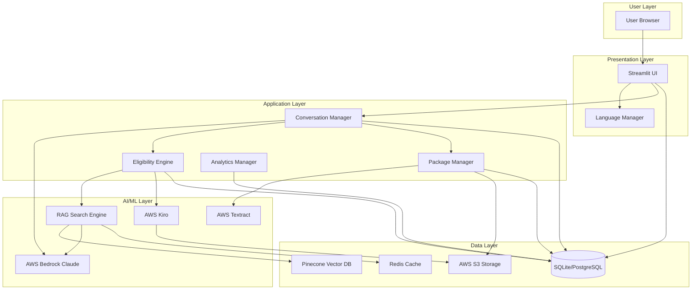
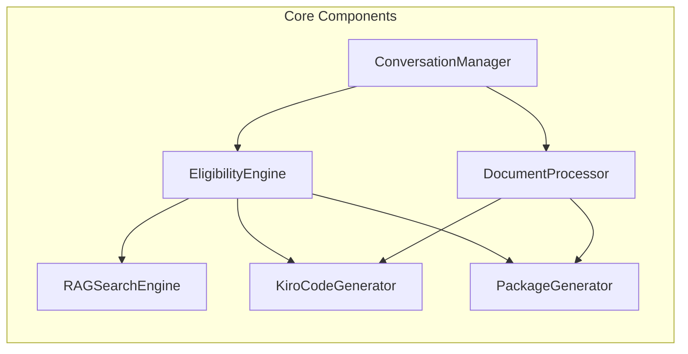
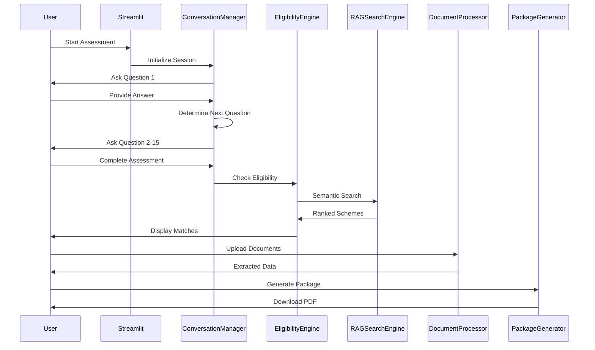
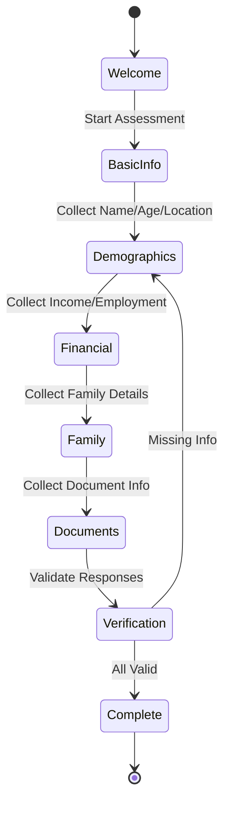
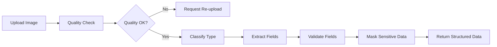

# Design Document: SchemeMatch AI

## Overview

SchemeMatch AI is an AI-powered government scheme discovery and application assistant that helps Indian citizens identify welfare schemes they qualify for and generate ready-to-submit application packages. The system combines conversational AI, RAG-based semantic search, OCR document processing, and automated code generation to create an end-to-end solution for scheme discovery and application preparation.

### Key Design Principles

1. **User-Centric Design**: Simple, accessible interface for users with varying literacy levels
2. **AI-Powered Automation**: Leverage AWS Bedrock (Claude Sonnet 4), Kiro, and Textract for intelligent processing
3. **Maintainability**: Auto-generated eligibility code that updates when policies change
4. **Privacy-First**: 30-day data retention, encryption at rest and in transit, no Aadhaar authentication
5. **Cost-Effective**: Designed to operate within AWS Free Tier limits
6. **Explainability**: Transparent reasoning for all eligibility decisions

### Technology Stack
- **Frontend**: Streamlit (Python 3.11+)
- **AI/ML**: AWS Bedrock (Claude Sonnet 4), AWS Kiro, AWS Textract
- **Vector Database**: Pinecone (free tier - 100K vectors)
- **Storage**: AWS S3 (encrypted)
- **Database**: SQLite (local development), PostgreSQL (production option)
- **Languages**: Python 3.11+
- **Deployment**: Streamlit Cloud, AWS Free Tier services

## System Architecture

### High-Level Architecture



### Component Architecture



### Data Flow



## Components and Interfaces

### 1. ConversationManager

**Purpose**: Manages multi-turn conversational eligibility assessment with adaptive questioning.

**Responsibilities**:
- Maintain conversation state across multiple turns
- Determine next question based on previous answers
- Classify user intent and extract entities
- Support multilingual conversations
- Save and resume incomplete assessments

**Interface**:

```python
class ConversationManager:
    def __init__(self, session_id: str, language: str = "en"):
        """Initialize conversation manager with session and language."""
        
    def start_assessment(self) -> Question:
        """Start a new eligibility assessment."""
        
    def process_answer(self, answer: str) -> ConversationResponse:
        """Process user answer and determine next action."""
        
    def get_next_question(self, context: UserContext) -> Optional[Question]:
        """Determine next question based on conversation history."""
        
    def is_assessment_complete(self) -> bool:
        """Check if sufficient data collected for eligibility check."""
        
    def get_user_profile(self) -> UserProfile:
        """Extract structured user profile from conversation."""
        
    def save_progress(self) -> None:
        """Save conversation state for later resumption."""
        
    def resume_assessment(self) -> Question:
        """Resume a previously saved assessment."""
```

**State Machine**:



**Key Algorithms**:
- **Adaptive Questioning**: Use decision tree based on previous answers to skip irrelevant questions
- **Intent Classification**: Use Claude to classify user intent (answer, clarification, skip, exit)
- **Entity Extraction**: Extract structured data (dates, amounts, locations) from natural language


### 2. EligibilityEngine

**Purpose**: Loads and executes Kiro-generated eligibility checker functions to determine scheme matches.

**Responsibilities**:
- Load dynamically generated eligibility checker functions
- Execute batch eligibility checks across all schemes
- Calculate confidence scores
- Generate eligibility explanations
- Handle errors in generated code gracefully

**Interface**:

```python
class EligibilityEngine:
    def __init__(self, schemes_dir: Path):
        """Initialize engine and load all eligibility checkers."""
        
    def check_eligibility(self, user_profile: UserProfile, scheme_id: str) -> EligibilityResult:
        """Check if user qualifies for a specific scheme."""
        
    def batch_check(self, user_profile: UserProfile) -> List[EligibilityResult]:
        """Check eligibility across all schemes."""
        
    def explain_decision(self, result: EligibilityResult) -> Explanation:
        """Generate human-readable explanation for eligibility decision."""
        
    def reload_checker(self, scheme_id: str) -> None:
        """Reload eligibility checker after code regeneration."""
        
    def validate_checker(self, scheme_id: str) -> ValidationResult:
        """Validate that checker function works correctly."""
```

**Eligibility Checker Function Signature** (generated by Kiro):

```python
def check_eligibility(user_data: dict) -> dict:
    """
    Check eligibility for [Scheme Name].
    
    Args:
        user_data: Dictionary containing user profile fields:
            - age: int
            - income: float (annual in INR)
            - state: str
            - caste: str (optional)
            - gender: str
            - family_size: int
            - employment_status: str
            - has_ration_card: bool
            - land_ownership: float (acres, optional)
            - disability_status: str (optional)
            
    Returns:
        Dictionary with:
            - eligible: bool
            - confidence: float (0-1)
            - criteria_met: List[str]
            - criteria_failed: List[str]
            - explanation: str
            - required_documents: List[str]
    """
    # Kiro-generated logic here
    pass
```

**Key Algorithms**:
- **Confidence Scoring**: Combine rule-based eligibility (0 or 1) with semantic similarity score from RAG
- **Batch Processing**: Use thread pool to check multiple schemes in parallel
- **Error Handling**: Catch exceptions in generated code and return low-confidence result

### 3. DocumentProcessor

**Purpose**: Classify, extract, and validate information from uploaded documents using OCR.

**Responsibilities**:
- Classify document type from image
- Extract structured fields using AWS Textract
- Validate document quality (blur, expiry, completeness)
- Suggest alternative documents when required ones are missing
- Mask sensitive information (Aadhaar numbers)

**Interface**:

```python
class DocumentProcessor:
    def __init__(self, textract_client, s3_client):
        """Initialize with AWS service clients."""
        
    def classify_document(self, image: bytes) -> DocumentType:
        """Classify document type using image classification."""
        
    def extract_fields(self, image: bytes, doc_type: DocumentType) -> ExtractedData:
        """Extract structured fields from document."""
        
    def validate_quality(self, image: bytes) -> QualityReport:
        """Check document quality (blur, resolution, expiry)."""
        
    def suggest_alternatives(self, missing_docs: List[DocumentType]) -> List[DocumentType]:
        """Suggest alternative acceptable documents."""
        
    def mask_sensitive_data(self, data: ExtractedData) -> ExtractedData:
        """Mask Aadhaar and other sensitive information."""
```

**Document Type Classification**:

```python
class DocumentType(Enum):
    AADHAAR = "aadhaar"
    PAN = "pan"
    INCOME_CERTIFICATE = "income_certificate"
    CASTE_CERTIFICATE = "caste_certificate"
    RATION_CARD = "ration_card"
    BANK_PASSBOOK = "bank_passbook"
    VOTER_ID = "voter_id"
    DRIVING_LICENSE = "driving_license"
    PASSPORT = "passport"
    BIRTH_CERTIFICATE = "birth_certificate"
    DISABILITY_CERTIFICATE = "disability_certificate"
    AGE_PROOF = "age_proof"
    ADDRESS_PROOF = "address_proof"
    EDUCATIONAL_CERTIFICATE = "educational_certificate"
    LAND_RECORDS = "land_records"
```

**Extraction Pipeline**:



**Key Algorithms**:
- **Blur Detection**: Calculate Laplacian variance; reject if < threshold
- **Expiry Detection**: Extract date fields and compare with current date
- **Field Validation**: Use regex patterns for Aadhaar (12 digits), PAN (10 chars), etc.

### 4. RAGSearchEngine

**Purpose**: Perform semantic search across scheme database using RAG (Retrieval-Augmented Generation).

**Responsibilities**:
- Generate embeddings for user profiles and scheme descriptions
- Perform vector similarity search in Pinecone
- Apply metadata filters (state, category, benefit amount)
- Rank results by relevance
- Cache frequent queries

**Interface**:

```python
class RAGSearchEngine:
    def __init__(self, pinecone_client, bedrock_client, cache_client):
        """Initialize with Pinecone, Bedrock, and Redis clients."""
        
    def search_schemes(self, user_profile: UserProfile, top_k: int = 10) -> List[SchemeMatch]:
        """Search for relevant schemes using semantic similarity."""
        
    def generate_embedding(self, text: str) -> List[float]:
        """Generate embedding vector using Bedrock."""
        
    def add_scheme(self, scheme: Scheme) -> None:
        """Add new scheme to vector database."""
        
    def update_scheme(self, scheme_id: str, scheme: Scheme) -> None:
        """Update existing scheme in vector database."""
        
    def delete_scheme(self, scheme_id: str) -> None:
        """Remove scheme from vector database."""
```

**Chunking Strategy**:
- Split scheme documents into chunks of 500 tokens with 50-token overlap
- Create separate embeddings for: scheme description, eligibility criteria, benefits, application process
- Store metadata: scheme_id, state, category, benefit_amount, source_url

**Search Algorithm**:

```python
def search_schemes(user_profile: UserProfile, top_k: int = 10) -> List[SchemeMatch]:
    # 1. Generate query text from user profile
    query_text = f"""
    User Profile:
    - Age: {user_profile.age}
    - Income: {user_profile.income}
    - State: {user_profile.state}
    - Category: {user_profile.caste}
    - Gender: {user_profile.gender}
    - Family Size: {user_profile.family_size}
    """
    
    # 2. Generate embedding
    query_embedding = generate_embedding(query_text)
    
    # 3. Search Pinecone with metadata filters
    results = pinecone.query(
        vector=query_embedding,
        top_k=top_k * 2,  # Get more for filtering
        filter={
            "state": {"$in": [user_profile.state, "Central"]},
            "active": True
        }
    )
    
    # 4. Re-rank by combining vector similarity + eligibility check
    ranked_results = []
    for result in results:
        eligibility = check_eligibility(user_profile, result.scheme_id)
        if eligibility.eligible:
            combined_score = 0.6 * result.score + 0.4 * eligibility.confidence
            ranked_results.append((result, combined_score))
    
    # 5. Sort and return top_k
    ranked_results.sort(key=lambda x: x[1], reverse=True)
    return ranked_results[:top_k]
```

**Caching Strategy**:
- Cache embeddings for common user profile patterns (TTL: 1 hour)
- Cache scheme search results for identical queries (TTL: 15 minutes)
- Invalidate cache when schemes are updated

### 5. KiroCodeGenerator

**Purpose**: Use AWS Kiro to automatically generate and maintain eligibility checker functions from scheme policy documents.

**Responsibilities**:
- Analyze scheme PDF documents
- Generate Python eligibility checker functions
- Generate unit tests for each function
- Detect policy changes and trigger regeneration
- Maintain version control of generated code

**Interface**:

```python
class KiroCodeGenerator:
    def __init__(self, kiro_client, s3_client):
        """Initialize with Kiro and S3 clients."""
        
    def generate_eligibility_checker(self, scheme_pdf_url: str, scheme_id: str) -> GeneratedCode:
        """Generate eligibility checker function from scheme PDF."""
        
    def generate_document_extractor(self, doc_type: DocumentType, sample_images: List[bytes]) -> GeneratedCode:
        """Generate document field extraction function."""
        
    def generate_tests(self, function_code: str) -> str:
        """Generate unit tests for a function."""
        
    def validate_code(self, code: str) -> ValidationResult:
        """Validate generated code syntax and run tests."""
        
    def detect_policy_change(self, scheme_id: str) -> bool:
        """Check if scheme policy has changed since last generation."""
        
    def regenerate_checker(self, scheme_id: str) -> GeneratedCode:
        """Regenerate eligibility checker after policy change."""
        
    def save_version(self, scheme_id: str, code: str, version: str) -> None:
        """Save code version to S3 with metadata."""
```

**Kiro Task Prompt Template** (for eligibility checker generation):

```python
ELIGIBILITY_CHECKER_PROMPT = """
Analyze the attached government scheme policy document and generate a Python function that checks user eligibility.

Requirements:
1. Function signature: def check_eligibility(user_data: dict) -> dict
2. Extract ALL eligibility criteria from the document (age, income, caste, state, gender, etc.)
3. Implement conditional logic to check each criterion
4. Return a dictionary with:
   - eligible: bool
   - confidence: float (0-1, use 1.0 for rule-based checks)
   - criteria_met: List[str] (which criteria the user satisfies)
   - criteria_failed: List[str] (which criteria the user doesn't satisfy)
   - explanation: str (human-readable explanation)
   - required_documents: List[str] (documents needed for application)
5. Include comprehensive docstring with parameter descriptions
6. Add type hints for all parameters and return values
7. Include error handling for missing or invalid fields
8. Use clear variable names and comments

Scheme Document: {pdf_url}
Scheme ID: {scheme_id}
"""

TEST_GENERATION_PROMPT = """
Generate comprehensive unit tests for the following eligibility checker function.

Requirements:
1. Use pytest framework
2. Create 5-10 test cases covering:
   - User who clearly qualifies (all criteria met)
   - User who clearly doesn't qualify (multiple criteria failed)
   - Boundary cases (age exactly at limit, income at threshold)
   - Missing required fields
   - Invalid data types
3. Use descriptive test names (test_eligible_when_all_criteria_met)
4. Include assertions for all return dictionary fields
5. Add comments explaining what each test validates

Function Code:
{function_code}
"""
```

**Version Control Schema**:

```python
@dataclass
class CodeVersion:
    scheme_id: str
    version: str  # Semantic versioning: 1.0.0
    code: str
    tests: str
    generated_at: datetime
    policy_hash: str  # Hash of source PDF for change detection
    validation_status: str  # "passed" or "failed"
    test_results: dict
```

**Change Detection Algorithm**:

```python
def detect_policy_change(scheme_id: str) -> bool:
    # 1. Fetch current policy PDF from official source
    current_pdf = fetch_scheme_pdf(scheme_id)
    current_hash = hashlib.sha256(current_pdf).hexdigest()
    
    # 2. Get stored hash from last generation
    last_version = get_latest_version(scheme_id)
    stored_hash = last_version.policy_hash
    
    # 3. Compare hashes
    if current_hash != stored_hash:
        # Policy changed - trigger regeneration
        return True
    
    return False
```

### 6. PackageGenerator

**Purpose**: Generate complete application packages as PDF files with pre-filled forms, documents, and submission guides.

**Responsibilities**:
- Create PDF with multiple sections (cover, forms, checklist, guide)
- Pre-fill forms with user data from assessment and OCR
- Generate document checklist showing attached/missing documents
- Include submission instructions with office details
- Add QR codes linking to official scheme websites
- Leave signature fields blank for manual signing

**Interface**:

```python
class PackageGenerator:
    def __init__(self, s3_client):
        """Initialize with S3 client for storage."""
        
    def generate_package(self, user_profile: UserProfile, scheme: Scheme, documents: List[Document]) -> ApplicationPackage:
        """Generate complete application package PDF."""
        
    def create_cover_page(self, user_profile: UserProfile, scheme: Scheme) -> bytes:
        """Generate cover page with scheme and user details."""
        
    def fill_application_form(self, scheme: Scheme, user_profile: UserProfile) -> bytes:
        """Pre-fill application form with user data."""
        
    def create_document_checklist(self, required_docs: List[DocumentType], uploaded_docs: List[Document]) -> bytes:
        """Generate checklist showing which documents are included."""
        
    def create_submission_guide(self, scheme: Scheme) -> bytes:
        """Generate step-by-step submission instructions."""
        
    def add_qr_codes(self, scheme: Scheme) -> bytes:
        """Generate QR codes for scheme website and helpline."""
        
    def merge_pdfs(self, sections: List[bytes]) -> bytes:
        """Combine all sections into single PDF."""
        
    def upload_to_s3(self, pdf: bytes, package_id: str) -> str:
        """Upload PDF to S3 and return download URL."""
```

**Package Structure**:

```
Application Package PDF:
├── Page 1: Cover Page
│   ├── Scheme Name & Logo
│   ├── User Name & Application ID
│   ├── Application Date
│   └── Disclaimer Text
├── Pages 2-N: Pre-filled Application Forms
│   ├── Personal Details Section
│   ├── Family Details Section
│   ├── Income Details Section
│   ├── Bank Details Section
│   └── Signature Field (blank)
├── Page N+1: Document Checklist
│   ├── ✓ Aadhaar Card (attached)
│   ├── ✓ Income Certificate (attached)
│   ├── ✗ Caste Certificate (missing - please attach)
│   └── ✓ Bank Passbook (attached)
├── Page N+2: Submission Guide
│   ├── Office Address & Map
│   ├── Contact Details & Helpline
│   ├── Office Hours
│   ├── Step-by-Step Instructions
│   └── Expected Processing Time
└── Page N+3: QR Codes & References
    ├── QR Code → Official Scheme Website
    ├── QR Code → Helpline Number
    └── Policy Document Reference
```

**Form Filling Algorithm**:

```python
def fill_application_form(scheme: Scheme, user_profile: UserProfile) -> bytes:
    # 1. Load form template (PDF with fillable fields)
    template = load_form_template(scheme.form_template_url)
    
    # 2. Map user profile fields to form fields
    field_mapping = {
        "applicant_name": user_profile.full_name,
        "father_name": user_profile.father_name,
        "date_of_birth": user_profile.dob.strftime("%d/%m/%Y"),
        "age": str(user_profile.age),
        "gender": user_profile.gender,
        "address": user_profile.address,
        "state": user_profile.state,
        "district": user_profile.district,
        "pincode": user_profile.pincode,
        "mobile": user_profile.mobile,
        "email": user_profile.email,
        "annual_income": str(user_profile.income),
        "caste_category": user_profile.caste,
        "aadhaar_last_4": user_profile.aadhaar_last_4,
        "bank_account": user_profile.bank_account,
        "bank_ifsc": user_profile.bank_ifsc,
    }
    
    # 3. Fill form fields using PyPDF2 or pdfrw
    filled_form = fill_pdf_fields(template, field_mapping)
    
    # 4. Flatten form (make fields non-editable except signature)
    final_form = flatten_pdf(filled_form, exclude_fields=["signature", "date"])
    
    return final_form
```


## Data Models

### UserProfile

```python
from dataclasses import dataclass
from datetime import date
from typing import Optional, List

@dataclass
class UserProfile:
    """Complete user profile collected from assessment and documents."""
    
    # Basic Information
    user_id: str
    full_name: str
    father_name: str
    mother_name: Optional[str]
    dob: date
    age: int
    gender: str  # "Male", "Female", "Other"
    
    # Contact Information
    mobile: str
    email: Optional[str]
    address: str
    district: str
    state: str
    pincode: str
    
    # Identity Information
    aadhaar_last_4: str  # Only last 4 digits
    pan: Optional[str]
    voter_id: Optional[str]
    
    # Financial Information
    income: float  # Annual income in INR
    employment_status: str  # "Employed", "Unemployed", "Self-Employed", "Student", "Retired"
    occupation: Optional[str]
    
    # Family Information
    family_size: int
    marital_status: str  # "Single", "Married", "Widowed", "Divorced"
    dependents: int
    
    # Category Information
    caste: str  # "General", "OBC", "SC", "ST"
    religion: Optional[str]
    minority_status: bool
    
    # Special Categories
    disability_status: Optional[str]  # "None", "Physical", "Visual", "Hearing", "Mental"
    disability_percentage: Optional[int]
    bpl_status: bool  # Below Poverty Line
    has_ration_card: bool
    ration_card_type: Optional[str]  # "APL", "BPL", "Antyodaya"
    
    # Assets
    land_ownership: Optional[float]  # In acres
    house_ownership: bool
    vehicle_ownership: bool
    
    # Banking
    bank_account: str
    bank_name: str
    bank_ifsc: str
    
    # Metadata
    created_at: datetime
    updated_at: datetime
    language_preference: str
    
    def to_dict(self) -> dict:
        """Convert to dictionary for eligibility checking."""
        return {
            "age": self.age,
            "income": self.income,
            "state": self.state,
            "district": self.district,
            "caste": self.caste,
            "gender": self.gender,
            "family_size": self.family_size,
            "employment_status": self.employment_status,
            "has_ration_card": self.has_ration_card,
            "ration_card_type": self.ration_card_type,
            "bpl_status": self.bpl_status,
            "disability_status": self.disability_status,
            "disability_percentage": self.disability_percentage,
            "land_ownership": self.land_ownership,
            "house_ownership": self.house_ownership,
            "minority_status": self.minority_status,
        }
```

### Scheme

```python
@dataclass
class Scheme:
    """Government welfare scheme information."""
    
    scheme_id: str
    name: str
    name_translations: dict  # {"hi": "हिंदी नाम", "ta": "தமிழ் பெயர்", ...}
    description: str
    description_translations: dict
    
    # Classification
    category: str  # "Education", "Health", "Housing", "Agriculture", "Employment", etc.
    level: str  # "Central" or "State"
    state: Optional[str]  # Required if level="State"
    
    # Benefits
    benefit_type: str  # "Financial", "Subsidy", "Service", "Training"
    benefit_amount: Optional[float]  # In INR, if applicable
    benefit_description: str
    
    # Eligibility
    eligibility_summary: str
    eligibility_function_path: str  # Path to Kiro-generated function
    eligibility_function_version: str
    
    # Application
    application_process: str
    required_documents: List[str]
    form_template_url: Optional[str]
    submission_office: str
    submission_address: str
    helpline_number: str
    
    # References
    official_website: str
    policy_document_url: str
    policy_hash: str  # For change detection
    
    # Metadata
    active: bool
    created_at: datetime
    updated_at: datetime
    last_verified: datetime
    
    # Vector DB
    embedding_id: str  # Pinecone vector ID
```

### EligibilityResult

```python
@dataclass
class EligibilityResult:
    """Result of eligibility check for a scheme."""
    
    scheme_id: str
    scheme_name: str
    eligible: bool
    confidence: float  # 0-1
    
    # Detailed Results
    criteria_met: List[str]
    criteria_failed: List[str]
    borderline_criteria: List[str]  # Criteria that are close to threshold
    
    # Explanation
    explanation: str
    recommendation: str  # "Apply Now", "Verify Details", "Not Eligible"
    
    # Requirements
    required_documents: List[str]
    missing_documents: List[str]
    
    # Metadata
    checked_at: datetime
    function_version: str
```

### Document

```python
@dataclass
class Document:
    """Uploaded document with extracted data."""
    
    document_id: str
    user_id: str
    document_type: DocumentType
    
    # File Information
    original_filename: str
    s3_key: str
    file_size: int
    mime_type: str
    
    # Quality
    quality_score: float  # 0-1
    blur_detected: bool
    resolution: tuple  # (width, height)
    
    # Extracted Data
    extracted_fields: dict
    extraction_confidence: dict  # Field -> confidence score
    
    # Validation
    is_valid: bool
    validation_errors: List[str]
    expiry_date: Optional[date]
    is_expired: bool
    
    # Metadata
    uploaded_at: datetime
    processed_at: datetime
    ocr_pages_used: int  # For tracking AWS Free Tier usage
```

### ApplicationPackage

```python
@dataclass
class ApplicationPackage:
    """Generated application package."""
    
    package_id: str
    user_id: str
    scheme_id: str
    
    # PDF Information
    pdf_s3_key: str
    pdf_url: str  # Pre-signed URL for download
    pdf_size: int
    page_count: int
    
    # Contents
    included_documents: List[str]
    missing_documents: List[str]
    pre_filled_fields: dict
    
    # Status
    status: str  # "Generated", "Downloaded", "Expired"
    download_count: int
    
    # Metadata
    generated_at: datetime
    expires_at: datetime  # URL expiry
    language: str
```

### ConversationState

```python
@dataclass
class ConversationState:
    """State of ongoing conversation."""
    
    session_id: str
    user_id: Optional[str]
    language: str
    
    # Progress
    current_question_id: str
    questions_asked: List[str]
    questions_remaining: List[str]
    progress_percentage: int
    
    # Collected Data
    answers: dict  # question_id -> answer
    extracted_entities: dict  # entity_type -> value
    partial_profile: dict
    
    # State
    is_complete: bool
    last_activity: datetime
    created_at: datetime
    
    # Context
    conversation_history: List[dict]  # For Claude context
    clarifications_needed: List[str]
```

### Question

```python
@dataclass
class Question:
    """Assessment question."""
    
    question_id: str
    question_text: str
    question_translations: dict
    
    # Type
    question_type: str  # "text", "number", "choice", "date", "boolean"
    choices: Optional[List[str]]  # For choice questions
    
    # Validation
    required: bool
    validation_rules: dict  # {"min": 0, "max": 100, "pattern": "regex"}
    
    # Help
    help_text: str
    examples: List[str]
    
    # Logic
    depends_on: Optional[str]  # question_id that must be answered first
    skip_conditions: dict  # Conditions to skip this question
```

## Database Schema

### SQLite Schema

```sql
-- Sessions table
CREATE TABLE sessions (
    session_id TEXT PRIMARY KEY,
    user_id TEXT,
    language TEXT NOT NULL,
    state TEXT NOT NULL,  -- JSON serialized ConversationState
    created_at TIMESTAMP DEFAULT CURRENT_TIMESTAMP,
    updated_at TIMESTAMP DEFAULT CURRENT_TIMESTAMP,
    expires_at TIMESTAMP
);

-- Users table
CREATE TABLE users (
    user_id TEXT PRIMARY KEY,
    profile TEXT NOT NULL,  -- JSON serialized UserProfile
    created_at TIMESTAMP DEFAULT CURRENT_TIMESTAMP,
    updated_at TIMESTAMP DEFAULT CURRENT_TIMESTAMP,
    last_login TIMESTAMP,
    data_retention_until TIMESTAMP  -- Auto-delete after 30 days
);

-- Schemes table
CREATE TABLE schemes (
    scheme_id TEXT PRIMARY KEY,
    name TEXT NOT NULL,
    category TEXT NOT NULL,
    level TEXT NOT NULL,
    state TEXT,
    data TEXT NOT NULL,  -- JSON serialized Scheme
    active BOOLEAN DEFAULT TRUE,
    created_at TIMESTAMP DEFAULT CURRENT_TIMESTAMP,
    updated_at TIMESTAMP DEFAULT CURRENT_TIMESTAMP,
    last_verified TIMESTAMP
);

-- Documents table
CREATE TABLE documents (
    document_id TEXT PRIMARY KEY,
    user_id TEXT NOT NULL,
    document_type TEXT NOT NULL,
    s3_key TEXT NOT NULL,
    data TEXT NOT NULL,  -- JSON serialized Document
    created_at TIMESTAMP DEFAULT CURRENT_TIMESTAMP,
    FOREIGN KEY (user_id) REFERENCES users(user_id) ON DELETE CASCADE
);

-- Applications table
CREATE TABLE applications (
    package_id TEXT PRIMARY KEY,
    user_id TEXT NOT NULL,
    scheme_id TEXT NOT NULL,
    pdf_s3_key TEXT NOT NULL,
    data TEXT NOT NULL,  -- JSON serialized ApplicationPackage
    status TEXT NOT NULL,
    created_at TIMESTAMP DEFAULT CURRENT_TIMESTAMP,
    downloaded_at TIMESTAMP,
    FOREIGN KEY (user_id) REFERENCES users(user_id) ON DELETE CASCADE,
    FOREIGN KEY (scheme_id) REFERENCES schemes(scheme_id)
);

-- Analytics events table
CREATE TABLE analytics_events (
    event_id TEXT PRIMARY KEY,
    user_id TEXT,
    session_id TEXT,
    event_type TEXT NOT NULL,  -- "assessment_started", "scheme_matched", "package_generated", etc.
    event_data TEXT,  -- JSON
    created_at TIMESTAMP DEFAULT CURRENT_TIMESTAMP
);

-- Code versions table (for Kiro-generated code)
CREATE TABLE code_versions (
    version_id TEXT PRIMARY KEY,
    scheme_id TEXT NOT NULL,
    version TEXT NOT NULL,
    code TEXT NOT NULL,
    tests TEXT NOT NULL,
    policy_hash TEXT NOT NULL,
    validation_status TEXT NOT NULL,
    test_results TEXT,  -- JSON
    created_at TIMESTAMP DEFAULT CURRENT_TIMESTAMP,
    FOREIGN KEY (scheme_id) REFERENCES schemes(scheme_id)
);

-- Indexes
CREATE INDEX idx_sessions_user ON sessions(user_id);
CREATE INDEX idx_sessions_expires ON sessions(expires_at);
CREATE INDEX idx_users_retention ON users(data_retention_until);
CREATE INDEX idx_schemes_category ON schemes(category);
CREATE INDEX idx_schemes_state ON schemes(state);
CREATE INDEX idx_documents_user ON documents(user_id);
CREATE INDEX idx_applications_user ON applications(user_id);
CREATE INDEX idx_analytics_user ON analytics_events(user_id);
CREATE INDEX idx_analytics_type ON analytics_events(event_type);
```

### Data Retention Policy

```python
def cleanup_expired_data():
    """Delete user data after 30 days (privacy compliance)."""
    
    # 1. Find users past retention period
    expired_users = db.query("""
        SELECT user_id FROM users 
        WHERE data_retention_until < CURRENT_TIMESTAMP
    """)
    
    # 2. Delete user data (cascades to documents and applications)
    for user_id in expired_users:
        # Delete S3 objects
        delete_user_s3_objects(user_id)
        
        # Delete database records (cascades)
        db.execute("DELETE FROM users WHERE user_id = ?", (user_id,))
    
    # 3. Delete expired sessions
    db.execute("""
        DELETE FROM sessions 
        WHERE expires_at < CURRENT_TIMESTAMP
    """)
    
    # 4. Anonymize analytics (keep aggregated data)
    db.execute("""
        UPDATE analytics_events 
        SET user_id = 'ANONYMIZED'
        WHERE user_id IN (SELECT user_id FROM expired_users)
    """)
```


## Correctness Properties

*A property is a characteristic or behavior that should hold true across all valid executions of a system—essentially, a formal statement about what the system should do. Properties serve as the bridge between human-readable specifications and machine-verifiable correctness guarantees.*

### Property 1: Assessment Question Count

*For any* user assessment session, the total number of questions asked should be between 10 and 15 (inclusive).

**Validates: Requirements 1.1**

### Property 2: Adaptive Questioning

*For any* two assessment sessions with different answers to the same initial questions, the subsequent questions asked should differ based on the context.

**Validates: Requirements 1.2**

### Property 3: Invalid Input Clarification

*For any* invalid or unclear user response during assessment, the system should request clarification with examples rather than proceeding with invalid data.

**Validates: Requirements 1.4**

### Property 4: Assessment Completeness

*For any* completed assessment, the resulting UserProfile should have all mandatory fields populated (age, income, state, gender, family_size, employment_status).

**Validates: Requirements 1.5**

### Property 5: Session Resume Preservation

*For any* assessment session that is saved and resumed within 24 hours, the conversation state (questions asked, answers provided, partial profile) should be identical to the state at save time.

**Validates: Requirements 1.7**

### Property 6: Vector Search Execution

*For any* complete user profile, performing scheme matching should query the vector database and return results.

**Validates: Requirements 2.1**

### Property 7: Confidence Score Validity

*For any* scheme match result, all confidence scores should be in the range [0, 1].

**Validates: Requirements 2.2**

### Property 8: Result Count Limit

*For any* scheme search query, the number of results returned should be at most 10.

**Validates: Requirements 2.3**

### Property 9: Explanation Presence

*For any* scheme match where the user is eligible, the result should contain a non-empty explanation field describing why the user qualifies.

**Validates: Requirements 2.5**

### Property 10: Benefit-Based Ranking

*For any* two schemes with confidence scores differing by less than 0.05, the scheme with the higher benefit amount should be ranked higher.

**Validates: Requirements 2.8**

### Property 11: Document Classification

*For any* uploaded document image, the system should classify it into exactly one of the 15 supported document types.

**Validates: Requirements 3.1**

### Property 12: OCR Field Extraction

*For any* successfully classified document, the extracted_fields dictionary should be non-empty and contain at least one field relevant to that document type.

**Validates: Requirements 3.3**

### Property 13: Quality Validation

*For any* document with blur_detected=True or resolution below minimum threshold, the quality_score should be less than 0.7 and is_valid should be False.

**Validates: Requirements 3.5**

### Property 14: Quality Failure Handling

*For any* document where quality validation fails (is_valid=False), the system should return an error response requesting re-upload.

**Validates: Requirements 3.6**

### Property 15: Alternative Document Suggestions

*For any* missing required document, the system should suggest at least one alternative acceptable document type.

**Validates: Requirements 3.7**

### Property 16: Aadhaar Masking

*For any* document classified as AADHAAR, the extracted_fields should contain only the last 4 digits of the Aadhaar number, with the rest masked.

**Validates: Requirements 3.9**

### Property 17: Eligibility Function Generation

*For any* scheme PDF provided to Kiro, a Python function with the signature `check_eligibility(user_data: dict) -> dict` should be generated.

**Validates: Requirements 4.1, 4.2**

### Property 18: Generated Code Quality

*For any* Kiro-generated eligibility checker function, the code should include type hints, a docstring, and at least one try-except block for error handling, and should pass Python syntax validation.

**Validates: Requirements 4.3, 4.8**

### Property 19: Test Generation

*For any* Kiro-generated eligibility checker function, between 5 and 10 unit tests should be generated alongside the function.

**Validates: Requirements 4.4**

### Property 20: Policy Change Detection

*For any* scheme where the policy document hash changes, the system should detect the change and trigger regeneration of the eligibility checker function.

**Validates: Requirements 4.6**

### Property 21: Code Version Control

*For any* code generation or regeneration event, a new CodeVersion record should be created with scheme_id, version number, code, tests, policy_hash, and timestamp.

**Validates: Requirements 4.7**

### Property 22: Validation Failure Handling

*For any* generated code that fails syntax validation, the system should log an error and set validation_status to "failed" without deploying the code.

**Validates: Requirements 4.9**

### Property 23: Application Package Generation

*For any* user selection of a scheme to apply for, an ApplicationPackage with a valid PDF should be generated and stored in S3.

**Validates: Requirements 5.1**

### Property 24: Package Completeness

*For any* generated ApplicationPackage PDF, it should contain all required sections: cover page with scheme name and user details, pre-filled forms, document checklist, submission guide, and QR codes.

**Validates: Requirements 5.2, 5.3, 5.4, 5.5, 5.6**

### Property 25: No Auto-Submission

*For any* application package generation, no HTTP requests should be made to government submission portals or APIs.

**Validates: Requirements 5.7**

### Property 26: Blank Signature Fields

*For any* generated application form PDF, all fields with names containing "signature" or "sign" should be empty (not pre-filled).

**Validates: Requirements 5.8**

### Property 27: Eligibility Explanation Completeness

*For any* eligibility result (eligible or not), the result should contain: a non-empty explanation, a list of criteria_met (if eligible) or criteria_failed (if not eligible), and links to policy sources.

**Validates: Requirements 6.1, 6.3, 6.4, 6.5**

### Property 28: Confidence Display

*For any* scheme match displayed in the UI, the confidence score should be shown as a percentage (0-100%) with a visual indicator.

**Validates: Requirements 6.2**

### Property 29: Borderline Uncertainty

*For any* eligibility result where any criterion is within 10% of its threshold, the result should include a recommendation for manual verification.

**Validates: Requirements 6.7**

### Property 30: Data Retention Auto-Deletion

*For any* user record where data_retention_until date is in the past, the user data, associated documents, and application packages should be automatically deleted from both database and S3.

**Validates: Requirements 7.1, 7.2**

### Property 31: No Aadhaar Authentication

*For any* operation in the system, no calls should be made to UIDAI Aadhaar authentication APIs.

**Validates: Requirements 7.3**

### Property 32: Encryption Configuration

*For any* user data stored in the database, S3 documents, or transmitted over network, encryption should be enabled (AES-256 at rest, TLS 1.2+ in transit, S3 SSE for storage).

**Validates: Requirements 7.6, 7.7, 7.8**

### Property 33: Usage Limit Alerting

*For any* resource (Textract pages, Pinecone vectors) where usage exceeds 80% of the free tier limit, an alert should be sent to administrators.

**Validates: Requirements 8.5**

### Property 34: Rate Limiting

*For any* request when usage limits are exceeded, the request should be queued and the user should receive a notification about the delay.

**Validates: Requirements 8.6**

### Property 35: Language Switching

*For any* language selection by the user, all UI elements, scheme descriptions, and eligibility criteria should be displayed in the selected language.

**Validates: Requirements 9.2, 9.3**

### Property 36: Bilingual Package Content

*For any* generated ApplicationPackage where the user has selected a non-English language, the PDF should contain content in both English and the selected language.

**Validates: Requirements 9.4**

### Property 37: Scheme Ingestion

*For any* new scheme added to the system, vector embeddings should be created and stored in Pinecone with all required metadata (scheme_id, name, category, state, benefit_amount).

**Validates: Requirements 10.2, 10.5**

### Property 38: Policy Change Flagging

*For any* detected policy change (hash mismatch), the scheme should be flagged for review and the flag should be visible to administrators.

**Validates: Requirements 10.4**

### Property 39: Scheme Change Logging

*For any* scheme update (add, modify, delete), an audit log entry should be created with timestamp, version number, and change description.

**Validates: Requirements 10.7**

### Property 40: Progress Indicators

*For any* long-running operation (assessment, document processing, package generation), a progress indicator should be displayed to the user.

**Validates: Requirements 11.2**

### Property 41: Error Messages with Suggestions

*For any* user error (invalid input, missing field, failed validation), the error message should include a suggested correction or example.

**Validates: Requirements 11.3**

### Property 42: Form Field Help Text

*For any* form field in the UI, a tooltip or help text should be available explaining what information is required.

**Validates: Requirements 11.6**

### Property 43: Action Confirmation

*For any* completed user action (assessment finished, document uploaded, package generated), a clear confirmation message should be displayed.

**Validates: Requirements 11.7**

### Property 44: Navigation State Preservation

*For any* backward navigation in the UI, all previously entered data should be preserved and displayed.

**Validates: Requirements 11.8**

### Property 45: Test Execution After Generation

*For any* Kiro code generation event, the generated unit tests should be automatically executed before the code is marked as ready for deployment.

**Validates: Requirements 12.5**

### Property 46: Test Failure Blocking

*For any* generated code where unit tests fail, the deployment should be blocked and the validation_status should be set to "failed".

**Validates: Requirements 12.6**

